Crime Analysis in the State of São Paulo (2016-2025)
================

github.com/RFaleiro
2026-03-09

## 1. Proposal

This report provides an extensive analysis of public safety data from the State of São Paulo from 2016 to early 2025. By aggregating over 80 different crime metrics, we aim to uncover macro trends, identify the fastest-growing anomalies post-pandemic, and highlight correlated criminal activities.

### 1.1 Database

Data extraction is performed automatically (via web scraping) directly from the portal of the Secretariat of Public Security of the State of São Paulo (SSP-SP).

To collect the complete year-by-year history, our script dynamically constructs the source URL for the statistical tables. The base address follows a structured pattern where the **year** and **quarter** are changed programmatically in the URL:

`https://www.ssp.sp.gov.br/assets/estatistica/trimestral/arquivos/{year}-{quarter}.htm`

**How the dynamic URL construction works:**

- **`{year}`**: Varies in a loop from 2016 to the current year (2025).
- **`{quarter}`**: Varies from `01` to `04` (always with two digits), representing each quarter of the respective year.

In this way, the crawler iteratively replaces these variables (for example, accessing the data page for `.../2023-01.htm`, followed by `.../2023-02.htm`, etc.) and downloads all reports, consolidating the entire history into a single large file for our analysis.

The PDF reports generated during the collection of raw data can be accessed directly through [this link to the `data/raw/pdf_ssp_reports/` folder](data/raw/pdf_ssp_reports/).

## 2. General Trends

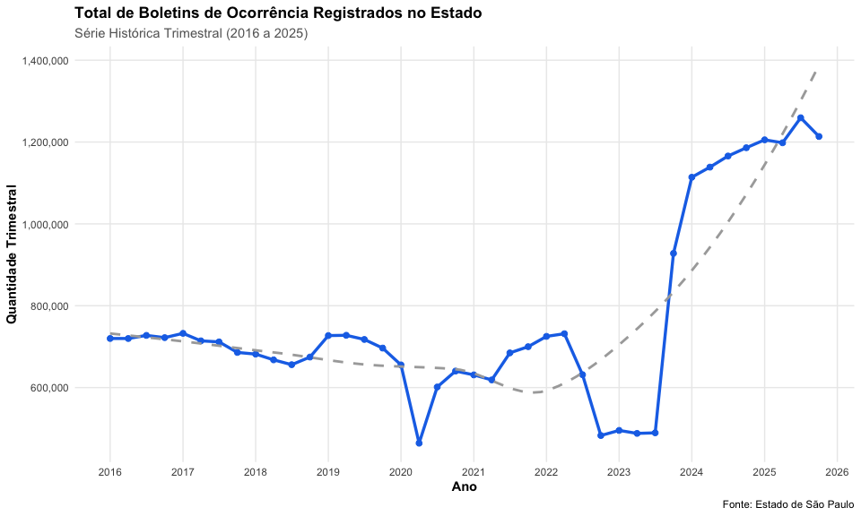<!-- -->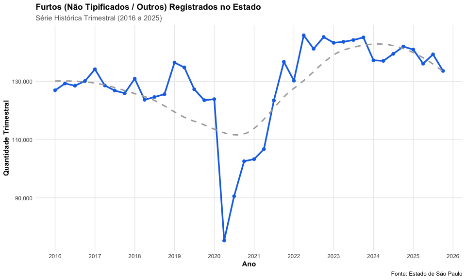<!-- -->

The exploratory analysis of the **General Trends** of public safety in São Paulo reveals two very clear scenarios in the historical series:

1. **The Alarming Escalation of Total Police Reports:** Looking at the overall line for the State, the pre-pandemic period (2016 to 2019) maintained a steady record of around **705,162 incidents per quarter**. After a natural and tragic stagnation of the numbers in 2020 and 2021 due to the lack of mobility during lockdowns (the great *valley* in the chart), there was a dramatic rebound: in the post-2022 period, the number of quarterly reports hit successive records, perpetuating itself at an absurd average of **990,152 records per quarter**. The peak of this volume denotes a staggering increase of **+40.4%** in routinely dispatched incidents compared to the pre-crisis historical average.

2. **The Mild and Uncorrelated Growth of Thefts:** Following opposite analytical paths, by isolating the so-called **Theft - Others** cases (those of low resolution and not purely framed in profiles like heavy vehicles), we notice that their pattern suffered a much lower shift. The database reveals that, before 2020, the average was *128,597* reported cases for these infractions and, even after the whole boom from 2023 onwards, it comfortably rose to a baseline of *140,173 cases*. This is an increase of **+9.0%**.

This leads us to a very important conclusion from an investigative point of view: **as simple thefts did not grow in the same frantic proportion as the whole, it is concluded that the critical advance of over 40% pushed onto the macro volume of the SP Secretariat of Public Security was heavily inflated by more diversified crimes, or even atypical and violent incidents that spiraled out of control along that same timeline.**

### 2.1 Fastest Growing Crimes

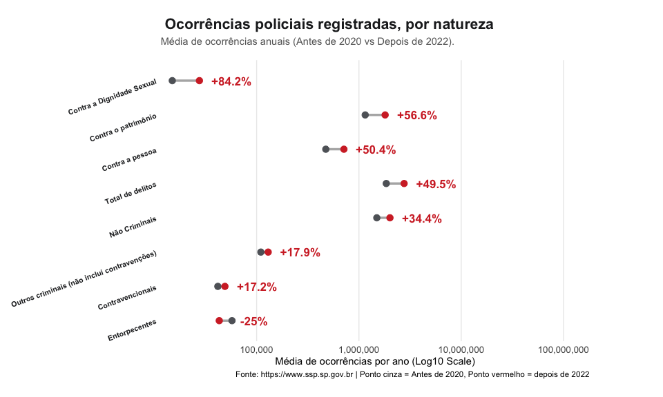<!-- -->

| Metric | Average incidents/Year (Pre-2020) | Average incidents/Year (Post-2022) | Growth |
|:---|:---|:---|:---|
| Against Sexual Dignity | 14,970 | 27,570 | 84.2% |
| Against Property | 1,152,063 | 1,803,896 | 56.6% |
| Against the Person | 474,304 | 713,229 | 50.4% |
| Total Offenses | 1,850,511 | 2,766,427 | 49.5% |
| Non-Criminal | 1,495,679 | 2,010,436 | 34.4% |
| Other Criminal (excludes misdemeanors) | 109,970 | 129,669 | 17.9% |
| Misdemeanors | 41,768 | 48,962 | 17.2% |
| Narcotics | 57,436 | 43,101 | -25.0% |

The Explosion of Violence Against Sexual Dignity and Property

The first dumbbell chart revealing the aggregated profiles **by criminal nature** viciously explains where the violent burden flowed after all the dismantling promoted by the social lockdown. The great driving force that most leveraged the macabre numbers against the civil society of São Paulo was terrifyingly associated with **Crimes Against Sexual Dignity** (which ballooned by an impressive **+84.2%** in absolute volume of incidents across the entire post-pandemic flow compared to the history up to 2019).

Following this horror, the demographic giants of the report, such as **Crimes Against Property** (increasing **+56.6%** and pulling the real brutal volume into the millions) and **Crimes Against the Person** (weighing **+50.4%** in the State) attest to an aggressive loss of brakes in all fields of urban and physical coexistence, disproportionately inflating the Total Offenses that we discussed elsewhere.

It is also noted that **Narcotics** was literally the only documented criminal front that dropped drastically (a linear drop of **-25%**). This possibly suggests an operational bottleneck, investigative underreporting, a massive change in command, or a strong alteration of strategies and operational focus on flagrant actions at the frontline in recent years.

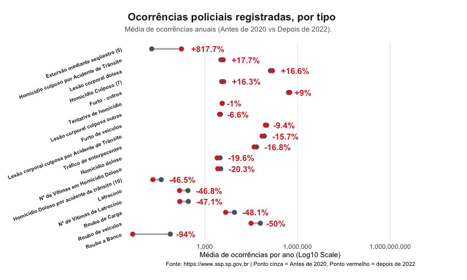<!-- -->

| Metric | Average police reports/Year (Pre-2020) | Average police reports/Year (Post-2022) | Growth |
|:---|:---|:---|:---|
| Extortion by Kidnapping (5) | 19 | 177 | 817.7% |
| Culpable Homicide by Traffic Accident | 3,356 | 3,951 | 17.7% |
| Intentional Bodily Harm | 133,105 | 155,160 | 16.6% |
| Culpable Homicide (7) | 3,526 | 4,099 | 16.3% |
| Theft - others | 514,388 | 560,691 | 9.0% |
| Attempted Homicide | 3,694 | 3,657 | -1.0% |
| Other Culpable Bodily Harm | 3,236 | 3,022 | -6.6% |
| Vehicle Theft | 101,440 | 91,863 | -9.4% |
| Culpable Bodily Harm by Traffic Accident | 84,933 | 71,603 | -15.7% |
| Drug Trafficking | 47,675 | 39,681 | -16.8% |
| Intentional Homicide | 3,136 | 2,520 | -19.6% |
| Number of Victims in Intentional Homicide | 3,298 | 2,628 | -20.3% |
| Intentional Homicide by traffic accident (10) | 39 | 21 | -46.5% |
| Robbery Resulting in Death (Latrocínio) | 287 | 153 | -46.8% |
| Number of Victims of Robbery Resulting in Death | 294 | 156 | -47.1% |
| Cargo Robbery | 9,148 | 4,748 | -48.1% |
| Vehicle Robbery | 62,850 | 31,397 | -50.0% |
| Bank Robbery | 77 | 5 | -94.0% |

**The Migration of Crime:** Extortions Explode, High-End Robberies Collapse: As we rigorously dissect the data within the criminal typifications of the second chart, an astonishing and very unique x-ray of the society of São Paulo takes shape. Common organized crime has operated a brutal pivot in the State of São Paulo, abandoning traditionally characterized crimes such as *'defense of elite and corporate property'* and draining into the impunity of the digital environment and direct extortion on the street.

**What Collapsed the Most:** There was a gigantic and statistically perfect collapse in incidents demanding direct confrontation against fortified and corporate capital. The database reveals that **Bank Robbery (a meltdown of -94%)**, **Vehicle Robbery (-50%)**, **Cargo Robbery (-48.1%)**, and even the tragic **Robbery Resulting in Death (-46.8%)** fell to almost half compared to the routine in São Paulo before 2020. The government has achieved apparent full control over the ostensible showcases of private/public security in high-equity strongholds.

**What Exploded the Most (The New "Brazil Cost"):** All criminality contained within corporate walls sought a terrifying compensation on the common civil citizen. The typification that suffered the most mind-boggling and bizarre increase in the entire history of the SSP-SP was **Extortion by Kidnapping (the infamous 'PIX Scam' / Express Kidnapping)**, which skyrocketed an absurd **+817.7%** (jumping from 19 cases/year to a stratospheric mapped average of 177 annual cases). This transition of the criminal leaving the bank door to invade the bank transaction on the hostage's cell phone on the street has proven to be an inescapable nightmare.

In parallel, urban social coexistence showed fatal fraying. **Homicides by Traffic Accident** increased significantly (**+17.7%**, averaging almost 4,000 recorded deaths under this scourge annually), and pure **Intentional Bodily Harm** (assault with intent to injure and generalized brawls from the streets to civilian homes) marked an increase of **+16.6%**, surpassing a horrifying level of more than 155,000 cataloged victims per year compared to the pre-lockdown period.

### 2.2 Trend for Crimes Against the Person

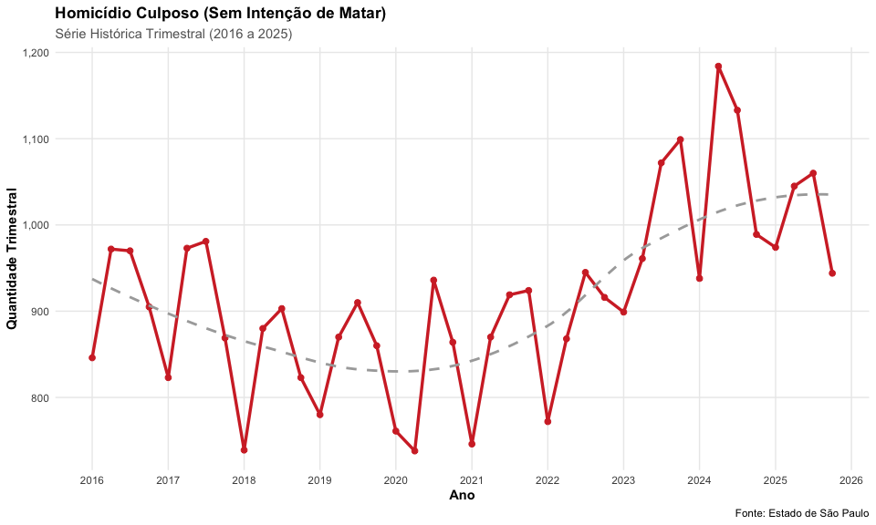<!-- -->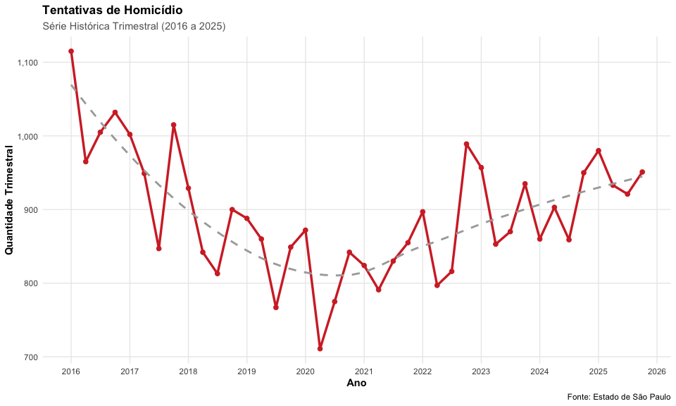<!-- -->

The specific analysis of **Crimes Against the Person**, addressing culpable deaths and attempts on life that were not consummated, brings an important counterpoint about what profile of violence is truly growing in the State of São Paulo:

1. **Consistent Increase in Culpable Homicides:** We observe a consolidated upward trend in culpable homicides (where there is no primary intent to kill, often associated with systemic fatalities, traffic violence, or reckless negligence). The series showed a contained average of about **882 cases** per quarter before the pandemic; however, the curve grew continuously to the point of repeatedly crossing the barrier of over **1,000 deaths/quarter** from 2023 onwards. This constitutes a systematic and non-negligible increase of **+16.3%**.

2. **Absolute Stability in Attempted Homicides:** In sharp contrast, *Attempted Homicides* (violent crimes, direct assaults with intent to kill, but intercepted) did not structurally worsen. Their pre-crisis average hovered around 924 quarterly records, fluctuating to exactly **914 cases/quarter** in the recent post-2022 period. This is a flattened variation of essentially **-1.0%** (perfect stability).

The combination of these two scenarios endorses the logic discussed in the general trend: by crossing the non-worsening of the active intention to kill on the one hand, and the formidable jump in lethal victims of culpable homicides on the other, we conclude that classic and premeditated violence on the streets of São Paulo has not advanced massively — structural danger and fatalities grew through more reckless/accidental paths within society or civil traffic.

### 2.3 Trend for Crimes Against Property

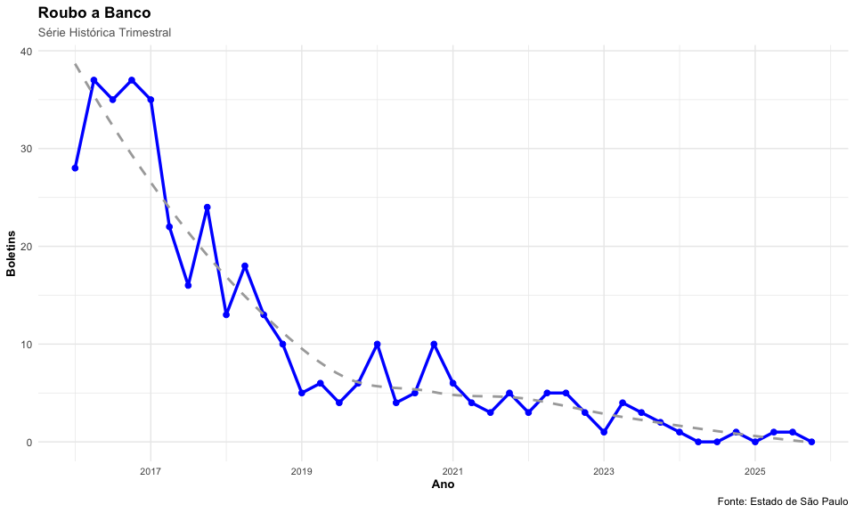<!-- -->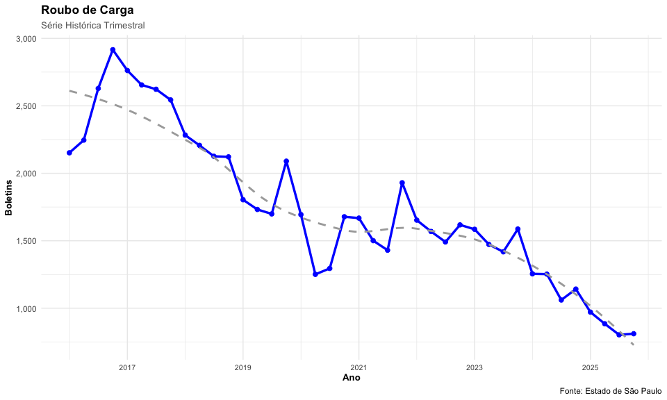<!-- -->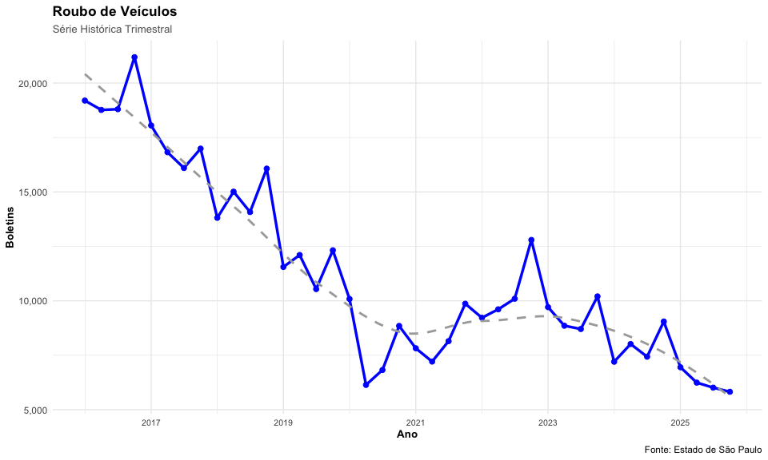<!-- -->

When we put the magnifying glass on the statistics regarding what is classically structured as the "Defense of Elite Property or Corporate Capital", we come across the only security front that has presented a resounding and true operational success in the last decade in the State of São Paulo. Even though the state's total incidents escalated by over +40%, the showcase crimes did not suffer the same fate:

1. **The Eradication of Bank Robbery:** Robberies of financial institutions, which required heavy gangs, cinematic logistics, and weapons of war — in addition to dealing a fatal blow to the State's armored capital — collapsed from the incident map formidably. The pre-pandemic average of almost 80 cases per year plummeted brutally and now verges on extinction (fluctuating around a mere 5 cases per year), depicting an overwhelming collapse of **-94%** for this modality.

2. **The Staunched Bleeding in Cargo and Vehicle Robbery:** In the same impeccable manner of operation (highly dependent on highways, high-end inspections, insurance companies, and ostensive policing), cargo robberies (which drained the corporate logistics infrastructure) and vehicle robberies (a very strong engine of standard property insecurity) were literally cut in half. The timeline perfectly illustrates the continuously sloping downward trend throughout the series: perfect and symmetrical drops of **-48% and -50%** in their average volumes, attesting to a state policy that undoubtedly knew how to brake the old billionaire extraction arteries of traditional crime in São Paulo.

## 3. Serious Crimes - Rape

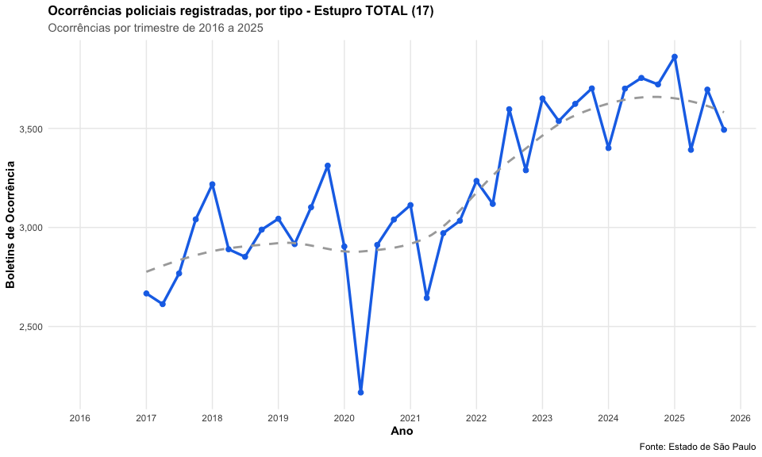<!-- -->

The historical series chart reveals a pronounced pattern break brought by the pandemic. In the second quarter of 2020, the largest drop in the series occurred (reaching only about 2,167 cases in a single quarter), which reflects the tragic underreporting caused by social isolation confinement. However, immediately after the return to normalcy, the curve not only returned to its average but assumed a vertiginous acceleration trend, climbing and breaking successive historical records until reaching critical levels above 3,800 quarterly incidents in 2024 and early 2025.

### 3.1 Rape Growth Rate

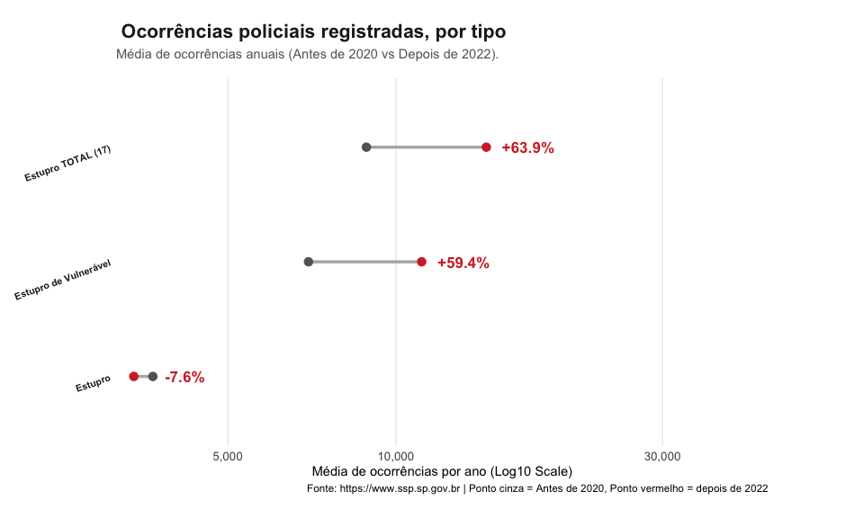<!-- -->

The chart above reveals that the category **Rape of Vulnerable Person** was the true engine of post-pandemic criminal growth, skyrocketing an astronomical +31% compared to 2019 (from 8,487 to 11,118 victims/year). Conversely, common "Rape" occurrences remained quantitatively stable (only a +2.3% increase), indicating that the alarming state-wide exacerbation stems primarily from violations against the vulnerable and minors.

## 4. Who Dies and Who Kills: Police Action

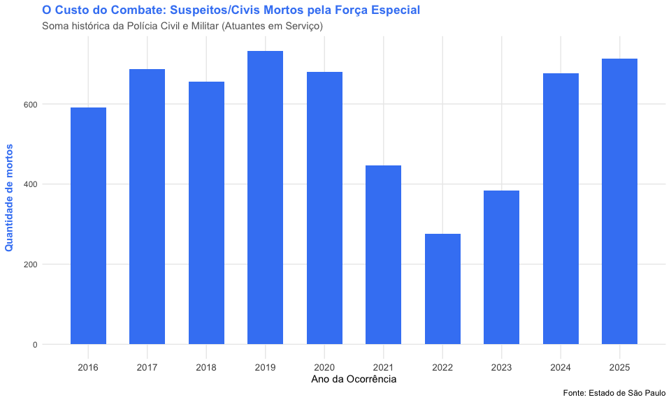<!-- -->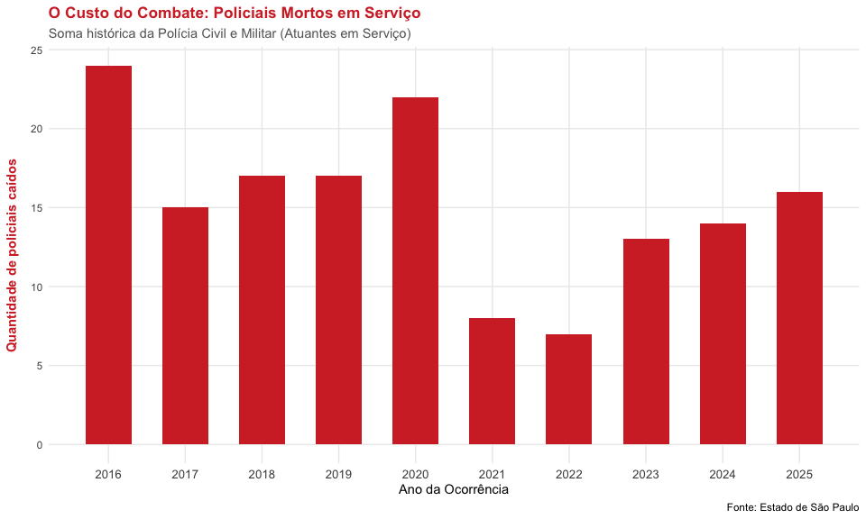<!-- -->

The tab regarding the scope of active confrontation by all State forces — embodied in the junction of the vital metrics of both the Civil and Military police simultaneously — delivers a sober reading of the lethality on the streets.

Unlike the urban panic observed in cybercrimes or open-street property violence, **The direct lethal combat for the monopoly of force has not grown**:

1. **Suspects Killed by Special Forces:** Driven mostly by the Military Police, civilians/suspects killed in direct confrontation during service fell substantially in the average cross-sections since 2016. Adding up all military and civil departments, the State historically saw around **660 people killed per year by troops up until 2019.** The modern period (post-2022) marked a strong turn toward stagnation: this volume reduced to average levels of **590 suspects killed in confrontation annually** (a contraction of almost -11%).
2. **Fewer Officers Fallen:** In turn, cross-fatality — the officers themselves fallen in service during the discharge of duty — also registered a low-margin retreat. The state system used to deal with an average of **18 officers killed per year** (combining the tolls of the Civil and Military together pre-pandemic), a number that has now stabilized around **14 funerals per year** at the SSP (a drop in lethality among agents of -20%).

What is understood, therefore, is that the general rise in urban danger experienced by common citizens was not translated by an increase in the traditional large-scale exchange of gunfire between heavy criminals and the ostensible military arms, which has become statistically and consistently more disengaged from the fatal lethal war with each passing year in the State of São Paulo.
